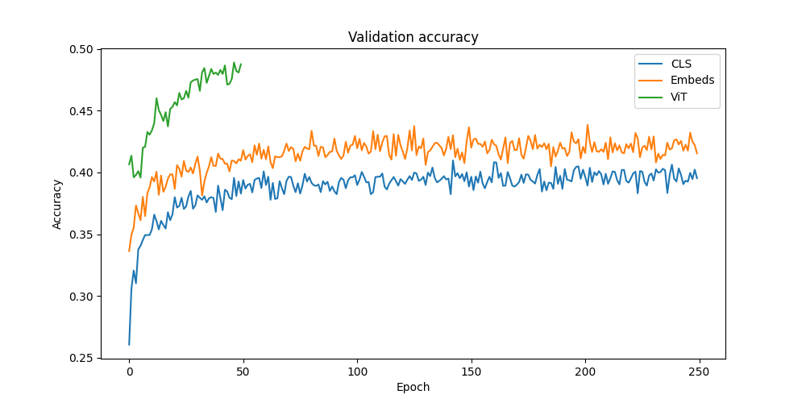

# Game Images Classification Using Transformers

Samuel Bubán	540 470

FI:PA026 Projekt z umělé inteligence

2024

## Introduction

Image classification is a well-known problem in machine learning, and it is traditionally solved using convolutional neural networks (CNNs) due to their proficiency in extracting and learning features from images. However, the architecture of CNNs comes with limitations, including the requirement for substantial computational resources and the potential inefficiency in capturing long-range dependencies within images.

Introducing the Vision Transformer (ViT) represents a new solution for image classification. This innovative approach, diverging from the norm of combining attention mechanisms with CNNs or using them as substitutes within CNN frameworks, has been validated by the paper introducing ViT. They demonstrate that when ViT is pre-trained on vast datasets, it matches or surpasses the performance of leading CNNs on significant image recognition benchmarks such as ImageNet, CIFAR-100, and VTAB and achieves this with substantially lower computational demands.

Our project explores the potential of a pre-trained Vision Transformer model in classifying images from a custom game image dataset. By leveraging a pre-trained ViT model, we aim to assess its capability to transform and utilize the feature tokens for our tasks.

## Dataset

Our dataset consists of a snapshot of games scraped from the Google Play Store downloaded at the end of 2022. In the first phase, the games are collected from all game categories and collections, ensuring a broad dataset. To further expand our dataset, we conducted a secondary scraping phase focused on game developers, incorporating all games published by each developer identified in the initial phase.

This two-step collection process resulted in a dataset encompassing 61,271 games, categorized into 17 distinct types of game - classes. It contains 505,763 images, with an average of 8.25 per game. The images in our dataset vary in resolution, ranging from a minimum of 223 pixels to a maximum of 512 pixels.

    <figure>
    
     
    <figcaption>Figure: Full dataset class distribution, showing some class imbalance.</figcaption>
    </figure>

&nbsp;

### Dataset Filtering

Having the diverse quality of games in the dataset, attributable to the open nature of the Google Play Store, where any developer can publish their game or projects, we implemented a filtering strategy to refine our dataset. We set the initial filtering criteria to include only games with a minimum of 10,000 installs and a rating of at least 4 out of 5. This selective approach aimed to halve the dataset size at the least, resulting in a more manageable subset of 20,874 games.

We introduced a second, more restrictive filtering phase to explore the impact of dataset quality on classification performance. This phase elevated the requirements to a minimum of 500,000 installs and a rating threshold of 4.4 out of 5, significantly reducing the dataset to just 4,905 games. We added this additional filtering step to enable comparative analysis of the effects of different dataset qualities on the image classification task.

## Image Classification

Image classification is a fundamental task in computer vision that involves assigning a label to an image from a predefined set of categories. This task is crucial for numerous applications, including facial recognition, object detection in autonomous vehicles, and content filtering. Traditionally, image classification has relied on manual feature extraction and machine learning algorithms. However, the advent of deep learning has significantly transformed the approach, leading to the development of models that can automatically learn hierarchical feature representations directly from the data.

### Convolutional Neural Networks

CNNs have been at the forefront of this transformation, providing powerful tools for image classification. CNNs process images through a series of convolutional layers that filter inputs for various features, followed by pooling layers that reduce dimensionality and fully connected layers that classify the image based on extracted features.

### VGG

The VGG (Visual Geometry Group) architecture is one example known for its simplicity and depth. VGG models, particularly VGG-16 and VGG-19, consist of 16 and 19 layers and employ 3x3 convolutional filters. This architecture showcased the importance of depth in deep learning models for achieving high performance in image classification tasks. Despite its simplicity, VGG's deep architecture allows it to learn complex patterns, making it a powerful tool for image classification.

### ResNet

ResNet (Residual Networks) introduced a novel approach to training very deep networks using residual blocks. These blocks allow direct information to pass across layers via skip connections, effectively addressing deep networks' vanishing gradient problem. Different-sized ResNets were introduced, with various layers: ResNet-50, ResNet-101, and ResNet-152. This architecture dramatically improved the performance of challenging image classification tasks by enabling the training of substantially deeper networks than was previously feasible.

### Vision Transformer

ViT represents a significant departure from traditional convolutional approaches to image classification, leveraging the transformer architecture's capacity for handling sequential data. Unlike CNNs, which apply convolutional filters and pooling layers to extract local features progressively, ViT treats an image as a series of patches and processes them using mechanisms derived from natural language processing.

### Classification Using ViT

The first step for the classification process in ViT is splitting an image into a fixed number of patches. These patches are then flattened and linearly projected into a higher-dimensional space. However, before these image patches pass through the transformer model, ViT introduces a unique learnable embedding, called the CLS (classification) token, to the sequence of embedded patches. This CLS token is pre-pended to the sequence of patch embeddings and is not related to any actual image patch. Instead, it serves as a unique element whose state at the transformer encoder's output represents the entire image's aggregate representation for classification purposes.

During the forward pass, the sequence of patch embeddings, along with the CLS token, passes through the transformer encoder layers, which use self-attention, allowing the model to weigh the importance of different patches as it sees fit. This process enables the model to focus on more informative parts of the image for the task at hand. The position embeddings are also added to the patch embeddings to retain positional information, as the self-attention mechanism has no inherent notion of order or position.

At the end of the transformer encoder, the final state of the CLS token is extracted and passed through a simple feed-forward neural network called the classifier head to produce the final classification output. The transformation of the CLS token throughout the transformer layers encapsulates the model's understanding and representation of the whole image, informed by the relationships between its various parts as determined by the self-attention mechanism.

### Advantages

This approach allows ViT to effectively capture both local and global dependencies across image patches, a significant advantage over traditional CNNs that might require deeper and more complex architectures to achieve similar global awareness. Furthermore, by leveraging the parallel processing capabilities of transformers and their efficiency in modeling relationships in data, ViT can often achieve superior performance on image classification tasks, especially when pre-trained on large datasets.

### Pre-Trained ViT Feature Extractor

Leveraging a pre-trained ViT model presents a significant advantage for our image classification task, mainly when dealing with limited computational resources or needing efficient model training. Pre-trained models are a robust starting point, learning feature representations from previous datasets. This pre-training phase allows the model to understand various visual patterns and elements, allowing further fine-tuning to focus on specific classification tasks with a smaller, domain-specific dataset.

### Model Selection

The first step is to select a pre-trained feature extractor (ViT backbone). We could compare multiple different trained and benchmarked models to choose the best one, but we already had a different use case for the model in mind, which narrowed down the selection.

Our other use case for this exact feature extractor is text generation based on image inputs. Using the Linearly Mapping From Image to Text Space paper as a reference, feature extractors trained with language generation in mind produce better text outputs when later used with other Large Language Models (LLMs). Because of this, we decided to use a ViT features extractor from ViT + GPT-2 vision encoder-decoder combo, available at HuggingFace to download: https://huggingface.co/nlpconnect/vit-gpt2-image-captioning

## Implementation

This section showcases the approach to implementing a ViT-based image classification system from the Transformers library in Python using PyTorch. By detailing the pre-processing steps, dataset handling, model architectures, and training methodologies, we provide insights into the practical challenges encountered in this project.

The source code for our project is attached to this report.

### Data Pre-processing

We pre-processed the entire dataset through a frozen ViT feature extractor to optimize computational efficiency. As the output for any given input image remains consistent, we can use pre-calculated output vectors for subsequent experiments. By focusing on the CLS tokens, we reduced the storage requirements for these pre-processed features to just 2 GiB across all datasets. This space requirement contrasts significantly with storing complete pre-processed feature datasets, which approached nearly 1 TiB.

### Custom Dataset and DataLoader

We developed custom Dataset and DataLoader classes tailored to our specific data structure, which includes handling stacks of images rather than individual ones. This adaptation is crucial for our model to leverage multiple images per game sample.

### Image Sampling

Our dataset contains game samples that have a variable number of associated images. For instance, while only four images might represent one game, another could have as many as sixteen.

    <figure>
        <table>
        <tr><td>Average number of images</td><td>9.19</td></tr>
        <tr><td>25th percentile</td><td>6</td></tr>
        <tr><td>50th percentile</td><td>8</td></tr>
        <tr><td>75th percentile</td><td>12</td></tr>
        <tr><td>90th percentile</td><td>16</td></tr>
        </table>
        <figcaption>Table: Image count statistics for the filtered dataset.</figcaption>
    </figure>

&nbsp;

We assign probabilities in decreasing order of importance to each image to prioritize their selection during training. The first image receives a selection probability of 0.5, the second 0.25, the third 0.125, and so forth. This probabilistic approach allows us to encode a sense of positional importance to the images.

### Dataset Imbalance

Given the inherent imbalance within our dataset, we experimented with both non-adjusted and weighted cross-entropy loss functions. It is important to note a slight oversight in our implementation: the weights were derived from the entire dataset rather than just the training subset. However, the distribution between our training and validation splits matches closely, mitigating any significant impact on our results.

### Model Architecture

The core of our implementation involved adapting the ViT feature extractor from an encoder-decoder model, specifically a combination of ViT and GPT-2. We experimented with various architectural designs for our classifiers, including models that process single-image CLS tokens, multiple-image CLS tokens, or the entire set of output feature vectors. These models range significantly in capacity, from a few thousand to several million trainable parameters. We also trained the ViT feature extractor in some experiments, increasing the model's total parameter count.

### Training

Our training process incorporates custom callbacks for model saving and extensive data logging, facilitating in-depth analysis and visualization of the training progression. We adopted a rolling train loss calculation - 99% of the previous loss plus 1% of the current loss. We implemented gradient accumulation to manage larger models and maintain a consistent minibatch size of 128 across all models.

The learning rate varied with model architectures, ranging between 1e-3 to 1e-4. Some training runs also utilized the Cosine Annealing Scheduler for learning rate.

### Metrics

During validation, we compute average loss and accuracy metrics, including top-1, top-3, and top-5 accuracies, to comprehensively evaluate model performance. However, this multi-metric approach was only adopted later in the testing after consultation.

### Iterative Model Training

Throughout the project, we trained numerous models, making iterative adjustments to our codebase to accommodate various architectural setups. This allows us a more straightforward approach to supporting multiple model configurations within a single code structure instead of supporting them all simultaneously.

## Evaluation

We started the evaluation phase with a series of hypotheses, each designed to test different aspects of our model's performance. For each hypothesis, we devised specific experiments to gather relevant data to explain the results of the model's behavior.

It is essential to clarify that our evaluation does not employ statistical tests to compare the outcomes of these experiments rigorously. Consequently, our ability to draw definitive conclusions from the results is limited. Instead, we focus on presenting the outcomes of our tested hypotheses and offer insights into the potential implications of the observed differences.

Furthermore, this report only encompasses some tested data combinations and graphical representations generated during our experiments. We direct readers to the supplementary materials attached to this report for a more comprehensive view of the data, including all graphs.

### The Impact of Data Imbalance on Model Performance

**Hypothesis**: Data imbalance influences model accuracy and its ability to learn from less-represented classes.

**Testing Approach**: Comparative analysis of models trained under two distinct conditions: one trained without any mechanisms to compensate for data imbalance and another trained with weighted cross-entropy loss to address the imbalance.

Figures on the left are without imbalance compensation, and those on the right are with imbalance compensation.

    <figure>
    
     
    <figcaption>Figure: Validation accuracy comparison.</figcaption>
    </figure>

&nbsp;

    <figure>
    
    
    <figcaption>Figure: Correctly predicted class counts vs total class counts.</figcaption>
    </figure>

&nbsp;

    <figure>
    
    
    <figcaption>Figure: Model predictions regardless of the correct class.</figcaption>
    </figure>

&nbsp;

**Supporting Conclusion**: The introduction of imbalance compensation through weighted cross-entropy loss benefits the recognition of less-represented classes, addressing our initial hypothesis. However, this strategy also introduces a trade-off by reducing the model's validation accuracy and altering its prediction distribution away from the dataset's inherent class distribution.

We use a less penalizing imbalance compensation function to learn from less-represented classes without significantly detracting from overall accuracy or distorting the prediction distribution. This is done by adding the minimal class weight to all weights, reducing the relative difference between all classes.

### Efficacy Evaluation of a Pre-trained Feature Extractor

**Hypothesis**: The pre-trained feature extractor is adequately suited to our dataset without extensive retraining or fine-tuning.

**Testing Approach**: Comparative analysis of the performance of different model configurations on classification accuracy. We tested three different model configurations:
CLS Classifier Head Only: Utilizes only the CLS token for classification, relying on the pre-trained feature extractor without additional training.
Full Features Classifier Head: Compute predictions based on the entire set of output features from the feature extractor, with no further training of the feature extractor.
ViT + CLS Classifier: Train the classifier head and the ViT feature extractor, exploring the benefits of fine-tuning the pre-trained model.

    <figure>
    
     
    <figcaption>Figure: Validation accuracy comparison (shows only the first 250 epochs of CLS accuracy for better readability).</figcaption>
    </figure>

&nbsp;

**Supporting Conclusion**: Our findings indicate a marginal benefit to utilizing the complete set of output features instead of relying solely on the CLS token, suggesting that the CLS token effectively encapsulates the information necessary for classification.

We observed increased accuracy when extending the model training to include both the classifier head and the ViT feature extractor. However, this improvement could have been more substantial, implying that the pre-trained feature extractor is already highly compatible with our dataset.

### Impact of Input Image Resolution on Classification Accuracy

**Hypothesis**: Increasing the resolution of input images enhances classification accuracy. The assumption behind this premise is that higher-resolution images provide more detailed visual information, potentially aiding in identifying features relevant to the classification task.

**Testing Approach**: Comparative analysis involving two configurations of ViT with a classification head:
Lower Resolution: The first model processed input images at a resolution of 224x224 pixels.
Higher Resolution: The second model processed input images at a higher resolution of 448x448 pixels.

    <figure>
    
     
    <figcaption>Figure: Validation accuracy comparison.</figcaption>
    </figure>

&nbsp;

**Supporting Conclusion**: There is no difference between the lower and higher resolution inputs, suggesting the extra feature tokens do not provide additional information for our classification task.

### Effects of Input Image Quantity on Classification Accuracy

**Hypothesis**: Including multiple images as input contributes to enhanced classification accuracy, assuming that additional images provide a more comprehensive set of information for the classification task, offering multiple perspectives that a single image alone might not sufficiently capture.

**Testing Approach**: Comparative analysis of three models:
Single-Image Classifier: Baseline model utilizing a single image per classification.
Single-Image Classifier with Multiple Inputs (Average Output): Process multiple evaluation input images separately through the same single image classifier, with the final classification decision derived by averaging the outputs.
Multi-Image Classifier: Process multiple images simultaneously, accounting for the potential positional importance of each input image.

    <figure>
    
     
    <figcaption>Figure: Validation accuracy comparison.</figcaption>
    </figure>

&nbsp;

**Supporting Conclusion**: Classifiers utilizing multiple image inputs demonstrate an improvement over single-image classification, supporting the added benefit of combining multiple input images for a classification task.

The Multi-Image Classifier achieved the highest accuracy among the tested models. Achieving the best performance suggests that the added positional context further aids in our dataset classification task.

### Optimizing Datasets for Improved Classification Accuracy

**Hypothesis**: Utilizing a dataset of higher-performing games, as determined by selected filtering criteria, increases classification accuracy. We are basing this hypothesis on the assumption that datasets with higher-quality game samples provide more distilled and potentially informative features for the classification task.

**Testing Approach**: Comparative analysis of 3 datasets:

    <figure>
        <table>
        <tr><td>Full dataset - no filtering</td><td>~ 60,000 games</td></tr>
        <tr><td>Filtered dataset</td><td>~ 20,000 games</td></tr>
        <tr><td>Heavily-filtered dataset</td><td>~ 5,000 games</td></tr>
        </table>
        <figcaption>Table: Dataset size comparison based on filtering criteria.</figcaption>
    </figure>

&nbsp;

    <figure>
    
     
    <figcaption>Figure: Validation accuracy comparison.</figcaption>
    </figure>

&nbsp;

**Supporting Conclusion**: Comparing the classification performance across the three datasets, our findings indicate that transitioning from the full dataset to the filtered dataset yields a slight but noteworthy improvement in accuracy. The anticipated reduction in training time due to the decreased dataset size also contributes to the filtered dataset's appeal. However, the accuracy gain observed when advancing to the heavily-filtered dataset is more pronounced. This further improvement underscores the premise that refining the dataset to encompass only higher-rated or more popular games - attributes we associate with higher quality - can contribute to enhanced model performance, albeit to a moderate extent.

These results imply that the quality of game samples within the dataset determined by our filtering criteria impacts classification accuracy.

### Review of the Final Model

Our research and experimentation have led to an optimized model that integrates the insights from multiple hypotheses testing. This final architecture combines the best findings to maximize classification accuracy.

Our final model consists of a trainable ViT feature extractor and the multi-image CLS classifier head to leverage the contextual information provided by multiple image inputs. The model is trained on the heavily filtered dataset to improve prediction accuracy further.

    <figure>
    
     
    <figcaption>Figure: Validation accuracy containing top-1, top-3, and top-5 scores.</figcaption>
    </figure>

&nbsp;

    <figure>
    
     
    <figcaption>Figure: Correct model predictions scaled by class sizes to range [0, 1].</figcaption>
    </figure>

&nbsp;

### Supplementary Model Comparisons

In addition to the focused experiments detailed in the main body of this report, we conducted comparisons across a spectrum of model architectures. Given the extensive nature of these tests, encompassing a wide array of models, the comprehensive analysis exceeds the scope of this report's primary narrative. To ensure accessibility to these insights, we have compiled all available data and results into an attachment accompanying this document. Readers interested in exploring the depth of our comparative model evaluations are encouraged to refer to this supplementary material for a more expansive view of our findings.

## Conclusion

Throughout this project, we embarked on an exploration, leveraging the power of a pre-trained Vision Transformer feature extractor as our main backbone. The project involved an extensive examination of various classification heads, each tested for efficacy with the ViT to optimize our model's performance.

Our experimentation was methodical and thorough, spanning a range of configurations from single-image classifiers to more complex multi-image classifiers. This process was instrumental in identifying the optimal architecture that could fully exploit the available multi-image game samples.

Our efforts culminated in developing a capable model that integrates a trainable CLS classifier head with the ViT feature extractor, capable of processing multiple images simultaneously. This final model represents the synergy of our exploratory work, combining the most effective elements discovered through our testing into a unified, powerful classification system.

We documented our comparisons and findings, showcasing the relative performances of various configurations and demonstrating the advantages of our tested models. These comparisons also validated our approach.

In conclusion, our project successfully demonstrates the viability and effectiveness of using a pre-trained ViT feature extractor with carefully selected classification heads to create an advanced image classification system. By methodically combining these components and rigorously testing our hypotheses, we have crafted a model utilizing all available information in the dataset. Our findings underscore the potential of Vision Transformers in image classification tasks.

## References

Dosovitskiy, Alexey, et al. "An image is worth 16x16 words: Transformers for image recognition at scale." arXiv preprint arXiv:2010.11929 (2020).

Simonyan, Karen, and Andrew Zisserman. "Very deep convolutional networks for large-scale image recognition." arXiv preprint arXiv:1409.1556 (2014).

He, Kaiming, et al. "Deep residual learning for image recognition." Proceedings of the IEEE conference on computer vision and pattern recognition. 2016.

Merullo, Jack, et al. "Linearly mapping from image to text space." arXiv preprint arXiv:2209.15162 (2022).

## Game Sample Examples

    <figure>
    
    
    
    
    <figcaption>Figure: Example images from the dataset: Advance car parking driving simulator.</figcaption>
    </figure>

&nbsp;

    <figure>
    
    
    
    
    
    <figcaption>Figure: Example images from the dataset: Adventure's Road Heroes Way.</figcaption>
    </figure>

&nbsp;

## Model Architectures

### Simple Classifier

Takes one image as input during training. If switched to the eval state, it takes all input images for final average classification; otherwise, choose one randomly.

### Simple Deep Classifier

It is the same as the Simple Classifier, with hidden layers added for extra computing capacity.

### Embed Classifier

Instead of taking only the CLS input token, consider all output vectors. We experimented with multiple approaches, one consisting of fully connected layers and others incorporating convolution layers for reduced parameter counts.

### Multi-Image Classifier

It takes all input images for final classification, converts them into a single long vector, and calculates class probabilities through a fully connected layer.

### Multi-Image Deep Classifier

It is the same as the Multi-Image Classifier, with hidden layers added for extra computing capacity.

### ViT + Classifier

When training the Vision Transformer, we also pre-train the classifier head on the frozen ViT feature extractor to align it with the existing model. Then, we load this pre-trained head on top of ViT and train them combined. However, they are trained on two different dataset samples, so at first, validation loss is lower than training loss - it has already seen some of the samples during training. This dataset splitting is a small implementation oversight but does not affect the results significantly.

### Learning Rates and Epoch Counts

We picked the learning rates as the highest possible value without detrimental results.

The number of training epochs depended on the computational requirements of each model. Smaller models ran for 1,000 epochs, medium models for 250 epochs, and the biggest models only ran for 50 epochs. While being among the biggest, the final model ran for 100 epochs, as it did not need to be compared with any other models anymore.

### Dataset Split

Our model training process utilized an 80-20 train-evaluation split to ensure robust performance assessment. Specifically, 80% of the dataset was randomly selected for training the model, while the remaining 20% was reserved for evaluation purposes. This random selection process was consistently applied across all model runs. Our dataset contains a sufficiently large number of samples, which ensures that randomly splitting it does not significantly affect the class distributions.

## Attached Files

### Dataset Sample

The dataset sample .json file is available in files/apps.json. It shows all available information for each game sample, unprocessed. From this, we extract the game genre and image links, download all images, and link them together.

Upon further request, we can also provide the complete dataset files (along with images).

### Training Runs

The runs are split into different folders for specific hypothesis testing.

The run names signify their model architecture or tested abilities.

All runs contain their configuration file in config.json.

Further, each run also contains logging data with graphs crafted from the latest epoch.

### Source code
